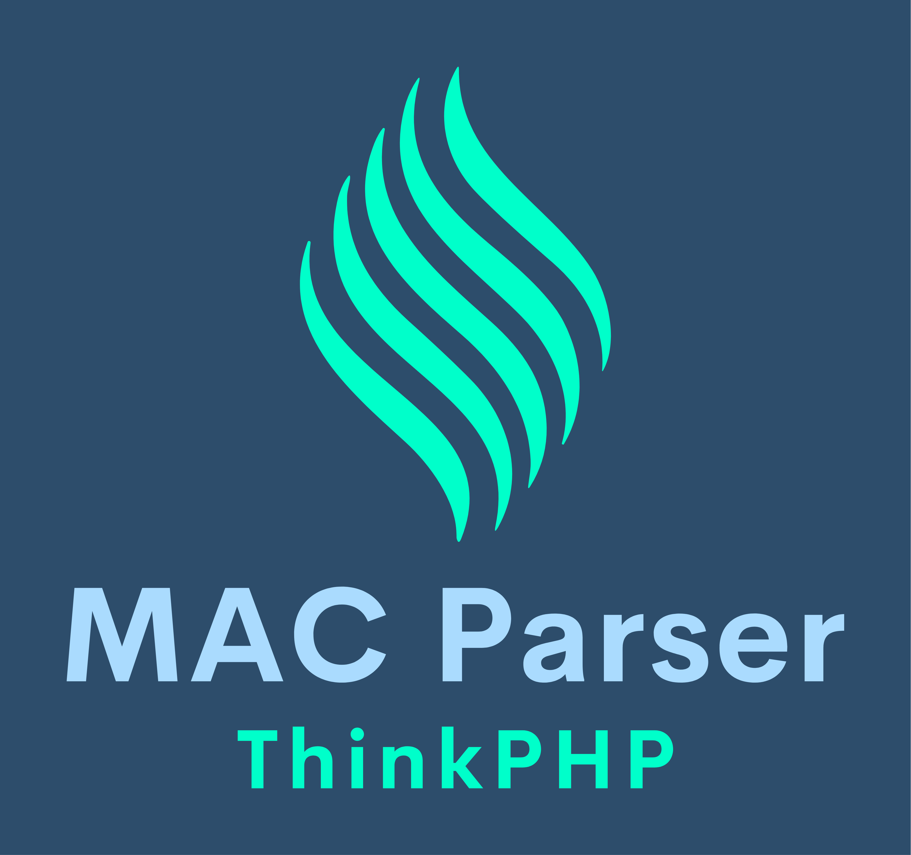

<p align="center">
  
</p>

<h1 align="center">ThinkPHP MAC Parser</h1>

<p align="center">
  <a href="https://github.com/delay-no-more/thinkphp-mac-parser/actions/workflows/php-tests.yml">
    
  </a>
  <a href="https://codecov.io/gh/delay-no-more/thinkphp-mac-parser">
    
  </a>
  <a href="https://packagist.org/packages/delaynomore/thinkphp-mac-parser">
    
  </a>
  <a href="https://packagist.org/packages/delaynomore/thinkphp-mac-parser">
    
  </a>
  <a href="https://packagist.org/packages/delaynomore/thinkphp-mac-parser">
    
  </a>
  <a href="https://github.com/delay-no-more/thinkphp-mac-parser/blob/master/LICENSE">
    
  </a>
  <a href="https://packagist.org/packages/delaynomore/thinkphp-mac-parser/stats">
    
  </a>
  <a href="https://github.com/delay-no-more/thinkphp-mac-parser/releases">
    
  </a>
  <a href="https://github.com/delay-no-more/thinkphp-mac-parser/commits/master">
    
  </a>
</p>

<p align="center">ThinkPHP MAC (Module-Action-Controller) 解析器，提供增强的URL解析功能，支持模块、控制器、方法的解析。</p>

## 📑 目录

- [功能特点](#功能特点)
- [安装](#安装)
- [快速开始](#快速开始)
  - [基本用法](#基本用法)
  - [自定义配置选项](#自定义配置选项)
- [主要方法](#主要方法)
  - [parseMac](#parsemacstring-url-array-options--array)
  - [parseDomain](#parsedomainstring-url-array-rules--string-domainroot--null-array)
  - [parseController](#parsecontrollerstring-url-array-options--array)
- [返回结果说明](#返回结果说明)
- [实际解析示例](#实际解析示例)
- [示例](#示例)
- [常见问题(FAQ)](#常见问题faq)
- [贡献](#贡献)
  - [参与方式](#参与方式)
  - [开发环境设置](#开发环境设置)
- [许可证](#许可证)

## ✨ 功能特点

- 解析URL获取模块、控制器、方法
- 支持域名绑定模块（支持多种匹配模式）
- 支持多级控制器解析
- 灵活的命名转换规则
- 支持特殊域名后缀处理

## 📦 安装

通过 Composer 安装：

```bash
composer require delaynomore/thinkphp-mac-parser
```

## 🚀 快速开始

### 基本用法

```php
<?php

use DelayNomore\ThinkMac\Parser;

// 解析完整URL
$result = Parser::parseMac('https://example.com/admin/user/view');

// 输出结果
var_dump($result);
```

### 自定义配置选项

```php
<?php

use DelayNomore\ThinkMac\Parser;

$options = [
    'default_module' => 'home',
    'default_controller' => 'index',
    'default_action' => 'index',
    'convert' => true,
    'bind_domains' => [
        'admin.example.com' => 'admin',
        'api.*' => 'api'
    ]
];

$result = Parser::parseMac('https://api.example.com/user/list', $options);
```

## 📝 主要方法

### parseMac(string $url, array $options = []): array

解析完整URL获取模块、控制器、方法。

**参数**:
- `$url`: URL地址
- `$options`: 选项数组
  - `bind_module`: 绑定模块，设置后bind_files和bind_domains无效
  - `bind_domains`: 绑定域名，格式为 ['domain' => 'module']，优先级高于bind_files
  - `bind_files`: 绑定文件，格式为 ['fileName' => 'module']，优先级低于bind_domains
  - `default_module`: 默认模块
  - `default_controller`: 默认控制器
  - `default_action`: 默认操作方法
  - `domain_root`: 根域名，用于处理特殊后缀，例如 'thinkphp.com.cn'
  - `convert`: 是否开启URL中控制器和操作名的自动转换

### parseDomain(string $url, array $rules = [], ?string $domainRoot = null): array

解析域名并提取模块名

### parseController(string $url, array $options = []): array

解析控制器路径和操作方法

## 📋 返回结果说明

`parseMac()` 方法返回包含以下键的数组：

- `module`: 模块名
- `controller`: 控制器名称（兼容旧版，等同于ctrl）
- `action`: 操作名（兼容旧版，等同于action）
- `ctrl`: 控制器名称，小写+下划线格式
- `class`: 控制器类名，大驼峰格式
- `method`: 操作方法名，小驼峰格式
- `dir`: 控制器子目录，多级控制器的目录部分，小写+下划线格式
- `path`: 控制器路径（不含模块），小写+下划线格式
- `fullpath`: 完整路径，包含模块/控制器/操作，如"module/dir/controller/action"
- `url`: URL格式路径，如"module/controller/action"或"module/dir.controller/action"
- `nested`: 是否为多级控制器
- `depth`: 控制器层级数量

## 📊 实际解析示例

以下是几个不同URL的实际解析结果：

### 基本URL解析

```php
$result = Parser::parseMac('https://example.com/admin/user/view');
```

返回结果：
```json
{
  "module": "admin",
  "ctrl": "user",
  "action": "view",
  "class": "User",
  "method": "view",
  "dir": "",
  "path": "user",
  "nested": false,
  "depth": 1,
  "controller": "user",
  "fullpath": "admin/user/view",
  "url": "admin/user/view"
}
```

### 多级控制器解析

```php
$result = Parser::parseMac('https://example.com/admin/user/manage/edit');
```

返回结果：
```json
{
  "module": "admin",
  "ctrl": "edit",
  "action": "index",
  "class": "Edit",
  "method": "index",
  "dir": "user/manage",
  "path": "user/manage/edit",
  "nested": true,
  "depth": 3,
  "controller": "edit",
  "fullpath": "admin/user/manage/edit/index",
  "url": "admin/user.manage.edit/index"
}
```

### 域名绑定模块解析

```php
$options = [
    'bind_domains' => ['api.example.com' => 'api']
];
$result = Parser::parseMac('https://api.example.com/v1/users', $options);
```

返回结果：
```json
{
  "module": "api",
  "ctrl": "users",
  "action": "index",
  "class": "Users",
  "method": "index",
  "dir": "v1",
  "path": "v1/users",
  "nested": true,
  "depth": 2,
  "controller": "users",
  "fullpath": "api/v1/users/index",
  "url": "api/v1.users/index"
}
```

## 📚 示例

可以查看 `examples` 目录下的示例文件，了解更多使用方法：

- `demo.php`: 基本演示
- `url_parse_example.php`: URL解析示例
- `controller_parse_example.php`: 控制器解析示例
- `domain_parse_example.php`: 域名解析示例

也可以直接使用内置的示例类：

```php
use DelayNomore\ThinkMac\example\Example;

Example::demoParseUrl();
Example::demoParseDomain();
Example::demoParseController();
```

## ❓ 常见问题(FAQ)

### 1. 如何处理多级控制器？

解析器默认支持多级控制器，例如 `admin/user/manage/edit` 将被解析为模块 `admin`，控制器路径 `user/manage/edit`。您可以通过返回结果中的 `dir`、`ctrl` 和 `path` 字段来获取详细信息。

### 2. 如何与ThinkPHP框架集成？

本解析器可以作为ThinkPHP框架的URL解析扩展使用。您可以在框架的路由配置中引入此解析器，替换默认的URL解析逻辑。详细集成方法请参考ThinkPHP官方文档中关于自定义URL解析器的部分。

### 3. 支持哪些版本的ThinkPHP？

本解析器兼容ThinkPHP 5.0及以上版本，特别优化了对ThinkPHP 6.0的支持。

### 4. 如何处理特殊的域名后缀？

您可以通过 `domain_root` 选项指定根域名，例如：

```php
$options = [
    'domain_root' => 'example.com.cn',
    'bind_domains' => ['admin' => 'admin']
];
$result = Parser::parseMac('https://admin.example.com.cn/user/list', $options);
```

### 5. 解析器的性能如何？

本解析器经过性能优化，在处理大量URL请求时表现良好。在标准测试环境中，每秒可处理数万次解析请求，对应用性能影响极小。

## 🤝 贡献

我们欢迎并感谢任何形式的贡献！如果您想为项目做出贡献，请查看 [贡献指南](CONTRIBUTING.md) 了解详细步骤。

参与本项目即表示您同意遵守我们的 [行为准则](CODE_OF_CONDUCT.md)。

### 参与方式

- 提交 Bug 报告
- 提出新功能建议
- 改进文档
- 提交代码修复或新功能

### 开发环境设置

```bash
# 克隆仓库
git clone https://github.com/delay-no-more/thinkphp-mac-parser.git

# 安装依赖
composer install

# 运行测试
./vendor/bin/phpunit
```

## 📄 许可证

MIT

---

<p align="center">最后更新: 2025-06-15</p>
